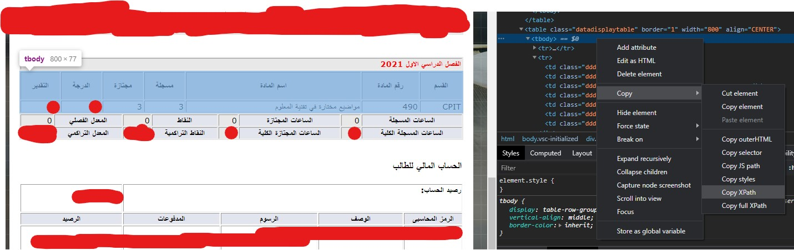

# gradesChecker
it's a Python script that will log in to the OdusPlus (University system) where students can see the grades of their courses and check if any new grade is uploaded in the current semester it will send an email to you :)

# Installation and setup
## install required dependencies
```
    pip install -r requirements.txt
```
## Update config.py with your current semester XPath and credentials
How to copy your currentSemesterBodyPath:


### run with ``` py main.py ```
#### if your chrome version is different you might need to change the chromedriver.exe
